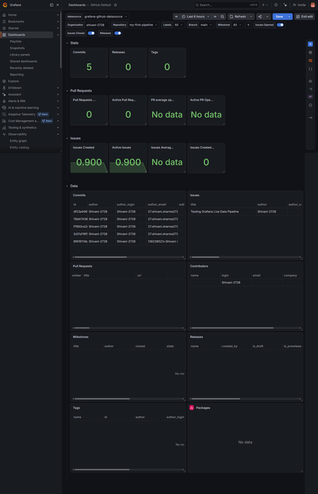

# 📊 DevOps Metrics Monitoring Dashboard

A version-controlled, production-ready **Observability-as-Code (OaC)** blueprint built on **Grafana Cloud** to track live repository health, developer commit frequencies, and pipeline deployments.

## 🖼️ Dashboard Live Preview

## 💡 Key Features Tracked
* **Developer Velocity:** Live counter tracking total code commits over a rolling 7-day period.
* **Continuous Integration Health:** Live tracking of workflow triggers and delivery timelines.
* **Issue Management:** Real-time visibility into active repository tickets and resolution pacing.

## ⚙️ How to Import and Replicate This Dashboard
You can recreate this identical monitoring layout in your own Grafana instance in seconds:
1. Copy the raw layout configuration code from the `my-dashboard.json` file in this repository.
2. In your Grafana Cloud console, navigate to **Dashboards** ➡️ **New** ➡️ **Import**.
3. Paste the copied text block into the **Import via panel JSON** console and click **Load**.
4. Authenticate your GitHub data source connection and select your personal username/repository parameters.
